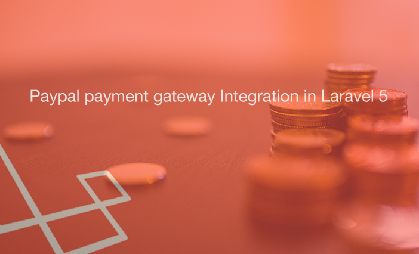

## Laravel with Paypal

[](http://127.0.0.1/)

> Motto: "trouble free payment for customer"

##### Announcements

*The project is developed by using PHP Laravel 5.4 framework. This is still in under progression. User can buy product from this site and pay through Paypal.*

## Installation

```sh
git clone https://kisorniru@bitbucket.org/kisorniru/laravel-with-paypal.git
cd laravel-with-paypal
create composer
// composer update
php artisan migrate:refresh
php artisan serve
```

## Authontication Document

The project is owned by [Md. Noor-A-Alam Siddique](http://127.0.01)

## Developer Document

The project is developed by [Md. Noor-A-Alam Siddique](http://127.0.01)